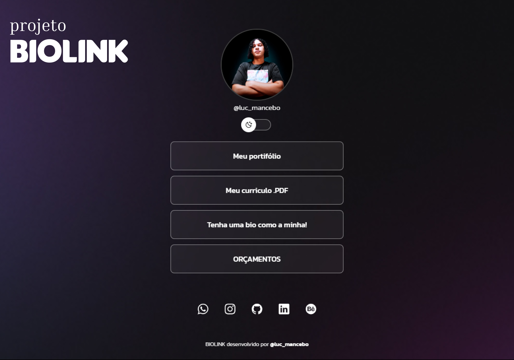

<h1 align="center"> BIOLINK </h1>

  <a href="#-tecnologias">Tecnologias</a>&nbsp;&nbsp;&nbsp;|&nbsp;&nbsp;&nbsp;
  <a href="#-projeto">Projeto</a>&nbsp;&nbsp;&nbsp;|&nbsp;&nbsp;&nbsp;
  <a href="#-layout">Layout</a>&nbsp;&nbsp;&nbsp;|&nbsp;&nbsp;&nbsp;
  <a href="#memo-licença">Licença</a>

  

 

  

## 🚀 Tecnologias

Esse projeto foi desenvolvido com as seguintes tecnologias:

- HTML e CSS
- JavaScript
- Git e Github
- Figma

## 💻 Projeto

Link para bio de redes sociais personalizável em HTML, CSS e JavaScript. O projeto permite que usuários personalizem a aparência e o conteúdo da sua bio, incluindo: Adição de seções com diferentes informações, formatação de texto e Integração de elementos interativos através de pequenas alterações no código.

- [Acesse o projeto finalizado, online](link) {:target="_blank"}

---

Feito Por Lucas Mancebo com apoio da Rocktseat